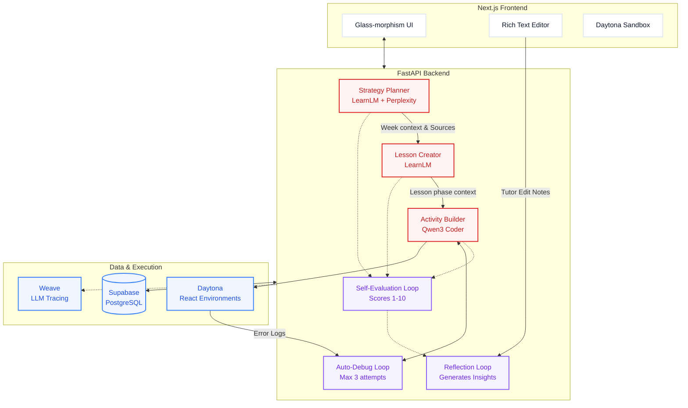

# TutorPilot AI - Self-Improving Educational Agent System

[](https://python.org)
[](https://fastapi.tiangolo.com)
[](https://nextjs.org)
[](https://typescriptlang.org)

**An AI agent system that learns from its mistakes and gets better over time.**


---

## 📋 Table of Contents

- [What Makes This Special](#-what-makes-this-special)
- [Architecture Overview](#%EF%B8%8F-architecture-overview)
- [Key Features](#-key-features)
- [Tech Stack](#%EF%B8%8F-tech-stack)
- [Quick Start](#-quick-start)
- [Project Structure](#-project-structure)
- [Author](#-author)

---

## 🌟 What Makes This Special

TutorPilot isn't just another AI tutoring app—it's an **agent that learns from its mistakes and continuously improves**. Watch it:

- ✨ **Self-Evaluate** its own outputs on 6 pedagogical criteria (1-10 each)
- 🔄 **Auto-Debug** its own React code when deployment fails (up to 3 attempts)
- 🧠 **Learn from Edits** when tutors improve its content (version history → insights)
- 📈 **Adapt Prompts** based on accumulated learning insights (reflection loop)
- 🤝 **Pass Context** between agents hierarchically (Strategy → Lesson → Activity)

---

## 🏗️ Architecture Overview

The system uses a hierarchical agent design. Research flows from top to bottom, minimizing redundant API calls and ensuring pedagogical alignment across all generated content.



---

## 🚀 Key Features

### 1. **Hierarchical Agent Handoff**

Agents pass context intelligently, **eliminating redundant API calls** and ensuring coherence:

```python
# User workflow:
Strategy (Week 2: "Forces and Motion")
    ↓ stores knowledge_contexts for all 4 weeks
Lesson Creator
    ↓ retrieves strategy context (auto-fills topic)
    ↓ reuses Perplexity sources (no redundant calls!)
    ↓ stores knowledge_context for this lesson
Activity Creator
    ↓ retrieves lesson context from database
    ↓ uses existing sources and explanations
    ↓ generates React code aligned with lesson content
```

**Result**: ~40% faster generation, ~60% cost savings on API calls.

### 2. **Comprehensive Lesson Plans**

Not just a simple 5E model—generates **production-ready lesson plans**:

- **Session Overview**: 2-3 sentence summary
- **Learning Objectives**: 3-5 measurable objectives (Bloom's taxonomy)
- **Study Guide**: Key questions, core concepts, visual aids description
- **Pre-Class Readings**: 2-3 articles/videos from Perplexity with reading questions
- **Pre-Class Work**: Pre-assessment quiz, reflection prompts, preparation tasks
- **Class Activities**: Detailed breakdown with materials (sourced!), durations, teacher notes
- **Homework**: Practice tasks, creative project, next class prep

### 3. **Interactive React Activities**

Generates **full React web pages** with Tailwind CSS, not just simple simulations:

```jsx
// Example: Chemical Bonding Simulator
- Interactive molecule builder with drag-and-drop
- Real-time visualization (gradients, animations, shadows)
- Immediate feedback on bond formation
- Gamified scoring and progress tracking
- Deployed to Daytona sandbox (live, public URL)
- Tailwind CSS for modern, responsive design
```

### 4. **Auto-Debugging Loop** 🔥

The agent **fixes its own code errors automatically**:

```
1. Generate React code with Qwen3 Coder 480B (W&B Inference)
2. Deploy to Daytona sandbox with Vite + React setup
3. Wait 10s, then check logs 3× (every 5s) for errors
4. IF errors detected (SyntaxError, missing semicolon, Babel errors):
   a. Extract error logs from Daytona process session
   b. Send to Qwen3: "Here's the error + original code, fix it"
   c. Get COMPLETE fixed code (not just diff)
   d. Redeploy to new sandbox
   e. Repeat up to 3 times (Gemini fallback if W&B fails)
5. SUCCESS: Return live sandbox URL
```


### 5. **Collaborative Editing**

**For Strategy & Lesson:**
- Google Doc-like rich text editor (TipTap)
- Full version history with edit notes
- Tutors explain **WHY** they edited (feeds learning insights)
- AI re-evaluates after edits to measure improvement delta


**For Activity:**
- Chat-based iteration: "Make molecules bigger, add sound effects"
- Agent uses Qwen3 to modify code conversationally
- Auto-redeploy after each change
- Chat history stored for learning insights


### 6. **Self-Evaluation with Detailed Criteria**

Every generation is scored on **6 criteria** (1-10 each) with reasoning:

**Strategy Agent:**
- Pedagogical Soundness, Cultural Appropriateness, Engagement Potential, Clarity, Feasibility, Progression

**Lesson Agent:**
- Pedagogical Soundness, Content Quality, Engagement, Differentiation, Clarity, Feasibility

**Activity Agent:**
- Educational Value, Engagement, Interactivity, Creativity, Code Quality, Feasibility

---

## 🛠️ Tech Stack

| Layer | Technology | Purpose |
|-------|-----------|---------|
| **Backend** | FastAPI (Python 3.12) | High-performance async API |
| **Frontend** | Next.js 14 (App Router) | Modern React with SSR |
| **Database** | Supabase (PostgreSQL) | Managed database with real-time capabilities |
| **AI Models** | Google LearnLM (Gemini Flash Lite) | Fast educational content generation |
| | Perplexity Sonar | Real-time research with credible sources |
| | Qwen3 Coder 480B | Code generation with W&B Inference |
| **Tracing** | Weave (W&B) | Full AI workflow observability + debugging |
| **Inference** | W&B Inference API | Hosted Qwen3 Coder 480B endpoint |
| **Sandboxes** | Daytona | Secure React app deployment with live URLs |
| **Styling** | Tailwind CSS | Modern, responsive design system |
| **Editor** | TipTap | Rich text collaborative editing |

---

## 📦 Quick Start

### Prerequisites

```bash
# Required accounts (all have free tiers):
✅ Supabase account
✅ Google AI Studio API key (LearnLM)
✅ Perplexity API key
✅ Weights & Biases account (Weave + Inference)
✅ Daytona account

# Required software:
✅ Python 3.12+
✅ Node.js 18+
```

### 1. Clone Repository

```bash
git clone https://github.com/itsbakr/weave-tutor.git
cd weave-tutor
```

### 2. Database Setup

Go to your Supabase Dashboard → SQL Editor and run:

```bash
# Run the complete schema (includes all tables + demo data)
database/complete-schema.sql
```

This creates:
- 12 tables (core entities, content, self-improvement, collaborative editing)
- Helper functions for version management
- Analytics views
- Demo tutors + students with rich profiles

### 3. Backend Setup

```bash
cd backend

# Create virtual environment
python3 -m venv venv
source venv/bin/activate  # Windows: venv\Scripts\activate

# Install dependencies
pip install -r requirements.txt

# Configure environment
cp .env.example .env
# Edit .env with your API keys
```

**Required .env variables:**
```bash
# Supabase
SUPABASE_URL=https://your-project.supabase.co
SUPABASE_ANON_KEY=your-anon-key

# AI Models
GOOGLE_LEARNLM_API_KEY=your-google-ai-studio-key
PERPLEXITY_API_KEY=pplx-your-key

# Weave & W&B Inference
WANDB_API_KEY=your-wandb-key
WANDB_PROJECT=tutorpilot-weavehacks

# Daytona
DAYTONA_API_KEY=your-daytona-key
```

### 4. Start Backend

```bash
uvicorn main:app --reload
# Backend: http://localhost:8000
# API docs: http://localhost:8000/docs
```

### 5. Frontend Setup

```bash
cd ../frontend

# Install dependencies
npm install

# Configure environment
echo "NEXT_PUBLIC_API_URL=http://localhost:8000" > .env.local

# Start development server
npm run dev
# Frontend: http://localhost:3000
```

### 6. Test the System

Open **http://localhost:3000** and:
1. **Strategy Page**: Generate a 4-week learning strategy for a student
2. **Lesson Page**: Create a comprehensive lesson from a strategy week
3. **Activity Page**: Generate an interactive React activity from a lesson phase

---

## 📂 Project Structure

```
weave-tutor/
├── backend/                      # FastAPI backend
│   ├── agents/                   # 5 AI agents
│   │   ├── strategy_planner.py  # 4-week strategies with Perplexity
│   │   ├── lesson_creator.py    # Comprehensive lessons
│   │   ├── activity_creator.py  # React code + auto-debugging
│   │   ├── evaluator.py         # Self-evaluation logic
│   │   └── reflection_service.py # Learning insights analysis
│   ├── services/                 # Core services
│   │   ├── ai_service.py        # LearnLM, Perplexity, Qwen3
│   │   ├── daytona_service.py   # Sandbox deployment (SDK)
│   │   ├── knowledge_service.py # Research queries
│   │   └── memory_service.py    # Agentic memory ops
│   ├── db/
│   │   └── supabase_client.py   # Database connection
│   ├── main.py                   # FastAPI app
│   ├── requirements.txt
│   └── README.md
│
├── frontend/                     # Next.js frontend
│   ├── app/                      # Pages (App Router)
│   │   ├── page.tsx             # Home (agent overview)
│   │   ├── strategy/page.tsx    # Strategy generator
│   │   ├── lesson/page.tsx      # Lesson generator
│   │   └── activity/page.tsx    # Activity generator
│   ├── components/               # React components
│   │   ├── RichTextEditor.tsx   # TipTap editor
│   │   ├── SelfEvaluationCard.tsx # Criteria display
│   │   ├── ActivityChat.tsx     # Code iteration
│   │   ├── SandboxPreview.tsx   # Daytona iframe
│   │   └── VersionHistory.tsx   # Content versions
│   ├── lib/
│   │   ├── api.ts               # API client
│   │   ├── types.ts             # TypeScript interfaces
│   │   ├── strategyFormatter.ts # Markdown → HTML
│   │   └── lessonFormatter.ts   # JSON → HTML
│   ├── package.json
│   └── README.md
│
├── database/                     # Database schema
│   ├── complete-schema.sql      # Full schema (12 tables)
│   └── README.md                # Schema documentation
│
├── docs/                         # Documentation
│   ├── PRD-WEAVEHACKS2-ARCHITECTURE.md
│   └── TASKS-WEAVEHACKS2-30HOURS.md
│
└── README.md                     # This file
```

---

## 👤 Author

**Ahmed Bakr**

- GitHub: [@itsbakr](https://github.com/itsbakr)
- Portfolio Project: [TutorPilot AI](https://github.com/itsbakr/weave-tutor)

---

**Made with ❤️ for educators and students worldwide.**

[⬆ Back to top](#-tutorpilot-ai---self-improving-educational-agent-system)